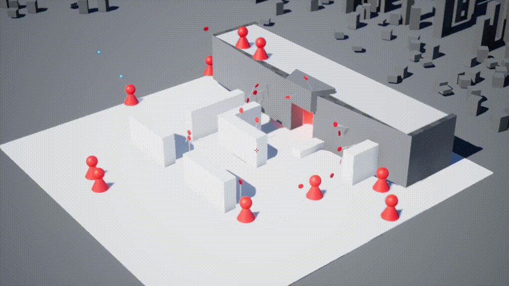

# TimeWarperUE
This project is a small game prototype mode in the Unreal engine, where you have a small time window to destroy all red targets by shooting them. After the time runs out the level resets and you respawn. Another character also spawns and executes exactly the action you did last round. Within a limited number of resets, you and your clones have to destroy all targets.

This prototype was developed by me over the course of three days in 2017.

[Click here for a longer gameplay video.](https://youtu.be/WMsE8JVw_I8)

